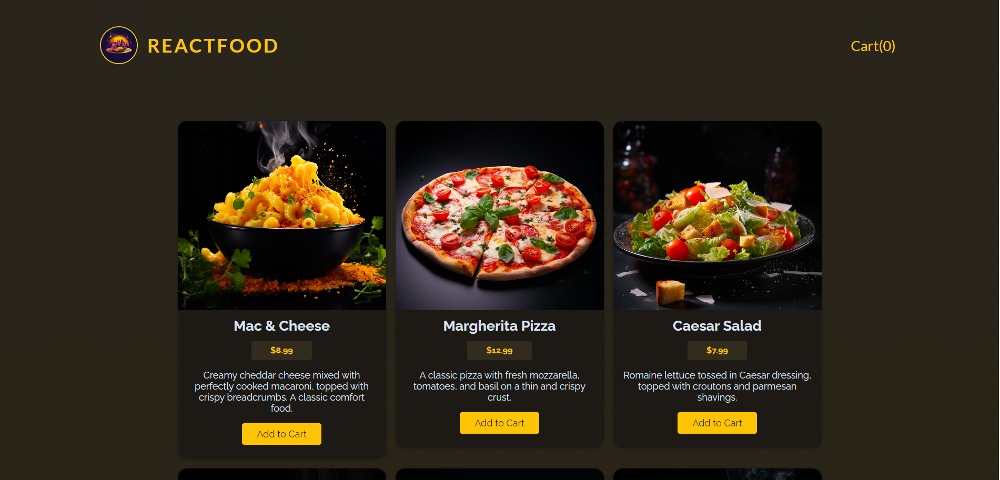

# Food Order APP

Food Order App is created to practice React.

## Run Locally

Clone the project

```bash
  git clone https://github.com/n0rb33rt/food-order-app
```

Go to the project directory

```bash
  cd food-order-app
```

Install dependencies for frontend

```bash
  npm install 
```

Run frontend

```bash
  npm run dev 
```

Install dependencies for backend

```bash
  cd backend
  npm install 
```

Run backend

```bash
  node app.js
```

## Main page



